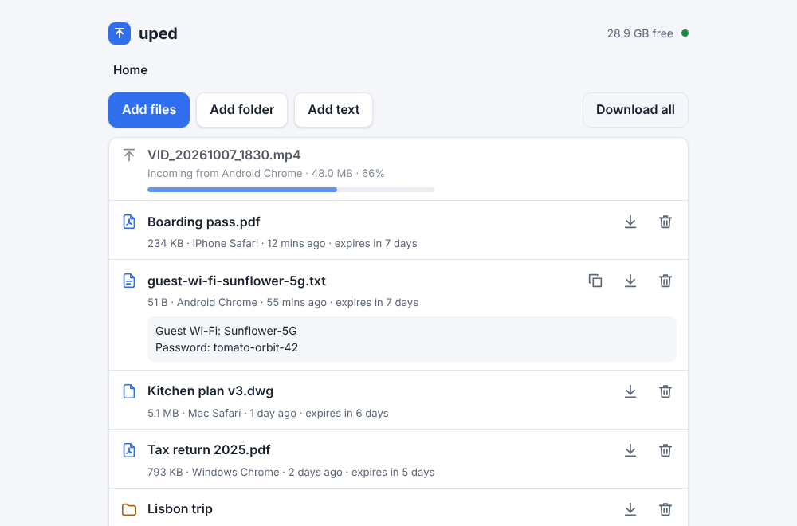
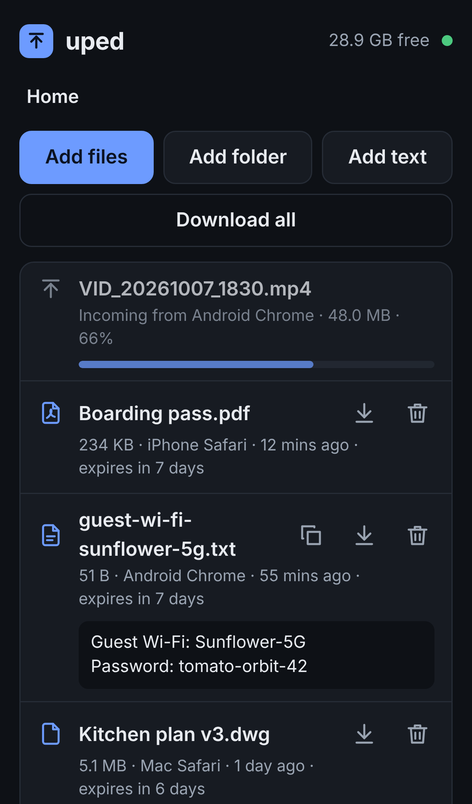

# uped

A USB stick for your home network. Run `uped` on a small Proxmox container (or
any Linux box), open its page from any device on your LAN, drop files or whole
folders onto it, and download them on another device. No accounts, no app to
install, no cloud. Uploads are chunked and resume after a dropped Wi-Fi
connection, and everything is deleted automatically after 7 days.

<p>
  
  
</p>

- **Any device, any browser.** Phones, tablets, laptops: open `http://<server>:8080`.
- **Files and folders.** Pick or drag them in; folder structure is kept. Download single files or a whole folder as a zip.
- **Big files.** Uploads go in 16 MiB chunks. If the connection drops they continue on their own; after a page reload, pick the same file again and it continues where it stopped.
- **Text and screenshots.** Paste anywhere on the page (or tap Add text on a phone) to share a link or a note; pasted images are uploaded as PNG. Notes have a Copy button.
- **Live.** Other open pages show new files, deletions and uploads in progress without reloading.
- **Tidy.** Every item shows which device sent it and when it expires. Nothing is ever overwritten: a second `photo.jpg` becomes `photo (1).jpg`.
- **Small.** One static binary of about 6 MB with the web page built in, no dependencies, no database.

## Quick start on Proxmox

uped runs comfortably in a small unprivileged Alpine container: 1 CPU, 512 MB
of memory and a 2 GB disk, plus whatever space you want for uploads.

**1. Create the container** in the Proxmox shell (or in the web UI with the same settings):

```sh
pveam update
TEMPLATE=$(pveam available --section system | awk '/alpine-3/ {print $2}' | sort -V | tail -n 1)
pveam download local "$TEMPLATE"
pct create 120 "local:vztmpl/$TEMPLATE" --hostname uped \
  --cores 1 --memory 512 --swap 512 --rootfs local-lvm:2 --unprivileged 1 \
  --net0 name=eth0,bridge=vmbr0,ip=dhcp --onboot 1 --start 1
```

Pick a free container ID instead of `120`, and your storage instead of
`local-lvm`. For a fixed address use `ip=192.168.1.50/24,gw=192.168.1.1`, or
reserve the container's address in your router. For more upload space, add a
volume mounted where uped keeps its files (here 50 GB), then restart the
container:

```sh
pct set 120 -mp0 local-lvm:50,mp=/var/lib/uped
```

**2. Install uped** inside the container (`pct enter 120`). Alpine comes with `wget`:

```sh
wget -qO- https://raw.githubusercontent.com/stasnowak/Uped/main/install.sh | sh
```

or, if you have `curl`:

```sh
curl -fsSL https://raw.githubusercontent.com/stasnowak/Uped/main/install.sh | sh
```

The installer downloads the latest release for your CPU (amd64 or arm64),
checks its SHA-256 checksum, creates a `uped` system user, sets up an OpenRC
service that starts on boot, starts it, and prints the address to open:

```
uped v0.1.0 is running. Open this on any device on your network:

    http://192.168.1.50:8080/
```

Bookmark that address on your devices. That is all.

### What goes where

| Path | What |
|---|---|
| `/usr/local/bin/uped` | the program |
| `/etc/init.d/uped` | OpenRC service, rewritten on every install |
| `/etc/conf.d/uped` | your settings, written once and kept on upgrades |
| `/var/lib/uped/files/` | uploaded files and folders, with their original names |
| `/var/lib/uped/.parts/` | uploads in progress |
| `/var/log/uped/uped.log` | log |

### Upgrade, uninstall

- **Upgrade:** run the install command again. It says "already up to date" if
  nothing changed, otherwise it replaces the binary and restarts the service.
  Your settings and files stay. To install a specific release, end the
  command with `sh -s -- --version v0.1.0` instead of `sh`.
- **Uninstall**, keeping settings and files:
  `wget -qO- https://raw.githubusercontent.com/stasnowak/Uped/main/install.sh | sh -s -- --uninstall`
- **Remove everything**, including uploaded files, logs and the `uped` user: the same with `--purge`.

`sh install.sh --help` lists the other options.

### Service and logs

```sh
rc-service uped status          # running?
rc-service uped restart         # after changing /etc/conf.d/uped
tail -f /var/log/uped/uped.log  # uploads, downloads, deletes and errors
```

The log grows by one line per upload, download or delete. To empty it:
`: > /var/log/uped/uped.log`.

## Configuration

Edit `/etc/conf.d/uped`, then `rc-service uped restart`. Outside the service,
the same settings are command-line flags, or `UPED_*` environment variables
(flags win).

| conf.d / environment | Flag | Default | Meaning |
|---|---|---|---|
| `UPED_LISTEN` | `--listen` | `:8080` | address and port; `:8080` is every interface |
| `UPED_DATA_DIR` | `--data` | `/var/lib/uped` | where files are stored |
| `UPED_TTL` | `--ttl` | `168h` | delete items this long after upload (`7d`, `24h`; `0` never) |
| `UPED_MIN_FREE` | `--min-free` | `1G` | refuse uploads that would leave less free disk than this |
| `UPED_MAX_FILE_SIZE` | `--max-file-size` | `0` | largest file accepted (`4G`, `500M`; `0` no limit) |
| `UPED_CHUNK_SIZE` | `--chunk-size` | `16M` | upload chunk size browsers use |
| `UPED_EXTRA_ARGS` | | | extra flags for the service, e.g. `--chunk-size 8M` |

Sizes take `K`, `M`, `G` or `T` (powers of 1024). `uped --help` shows them all
and `uped --version` prints the version.

## Docker

There is also a multi-arch image (amd64, arm64):

```sh
docker run -d --name uped --restart unless-stopped \
  -p 8080:8080 -v uped-data:/data ghcr.io/stasnowak/uped
```

Settings are the `UPED_*` variables above, for example `-e UPED_TTL=72h`. The
image runs as uid 65532, so a host folder mounted at `/data` must be writable
by that user: `sudo chown 65532:65532 /srv/uped` before `-v /srv/uped:/data`.
The log goes to `docker logs uped`. Open the host's address, not the
container's.

## How it works

- **Uploads** are sent in chunks with `XMLHttpRequest`, one file at a time per
  browser tab. The server appends each chunk to a partial file and checks its
  offset, so a lost chunk is simply sent again. After five failed retries an
  upload pauses with a Retry button; it also resumes when the tab becomes
  visible again or the device comes back online.
- **Resume after a reload:** the browser cannot reopen a file by itself, so pick
  or drop the same file again. uped recognises it (name, size, date, folder)
  and continues from the bytes it already has. Files that already finished
  are skipped, so re-dropping a half-uploaded folder only sends what is missing.
- **Expiry:** an item is deleted `UPED_TTL` after its upload finished (7 days by
  default). A sweep every 15 minutes also removes uploads idle for 24 hours and
  empty folders. There is no "keep" button.
- **Disk guard:** an upload is refused up front, and checked again while it
  runs, if it would leave less than `UPED_MIN_FREE` free. The page then shows
  "Disk full on the server" and pauses the queue.
- **Names:** characters Windows cannot store (`: * ? " < > |`) become `_`;
  everything else, including accents and emoji, is kept. Names are compared
  without case, so `Photo.JPG` next to `photo.jpg` becomes `Photo (1).JPG`.

## Limitations

- **Plain HTTP.** Browsers mark the page "Not secure", and features that need
  HTTPS (installing as an app, the share sheet, the modern clipboard API) are
  unavailable. Copying uses an older method that works everywhere.
- **iPhone and iPad** stop a page's uploads a few seconds after Safari goes to
  the background or the screen locks. Keep Safari open; uploads continue when
  you come back.
- **Resume after a reload** needs the same file picked again (see above).

## Security

uped has **no login by design**: anyone who can reach the port can see,
download and delete everything. Run it on your home network only and **never
forward its port to the internet**. For access from outside, use a VPN into
your network (WireGuard, Tailscale). Downloads are always served as
attachments with a sandboxing `Content-Security-Policy`, so an uploaded HTML
file cannot run as a page on uped's address.

## Building from source

Go 1.24 or newer, nothing else. On Alpine 3.22 or newer:

```sh
apk add go git
git clone https://github.com/stasnowak/Uped && cd Uped
CGO_ENABLED=0 go build -o uped ./cmd/uped
sh install.sh --binary ./uped    # optional: install it as a service
```

For development (see `CLAUDE.md` and `plans/uped-home-file-drop.md`):

```sh
make build              # dist/uped
make test               # go vet and unit tests with the race detector
make run                # http://127.0.0.1:8080 with files in ./data
make e2e                # Playwright browser tests (Node 22)
sh scripts/smoke.sh     # HTTP smoke test of dist/uped
sh scripts/test-install.sh   # installer tests, no root needed
make cross              # release tarballs and checksums.txt in dist/
```

## License

MIT, see [LICENSE](LICENSE).
